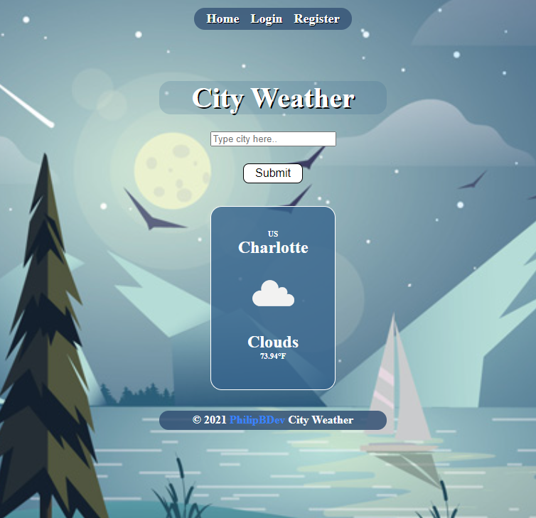

  <h3 align="center">City Weather - Client</h3>
    <p align="center">
<a href="https://github.com/PhilipBDev/MERN-Weather-App-SERVER">View Server Repository</a>
</p>

<p>
Due to the server running on a free tier of Heroku, please allow roughly 60 seconds for the website to display properly. After about a minute, refresh the page and the navbar should be displayed at the top of the page.
</p>

  <p align="center">
    <br />
    <a href="https://www.myweather.city">View Demo</a>
    ·
    <a href="https://github.com/PhilipBDev/MERN-Weather-App-CLIENT/issues">Report Bug</a>
    ·
    <a href="https://github.com/PhilipBDev/MERN-Weather-App-CLIENT/issues">Request Feature</a>
    </p>

<p align="center">
  <a href="https://www.myweather.city">
    
  </a>
</p>

<!-- TABLE OF CONTENTS -->
<details open="open">
  <summary><h2 style="display: inline-block">Table of Contents</h2></summary>
  <ol>
    <li>
      <a href="#about-the-project">About The Project</a>
      <ul>
        <li><a href="#built-with">Built With</a></li>
      </ul>
    </li>
    <li>
      <a href="#getting-started">Getting Started</a>
      <ul>
        <li><a href="#installation">Installation</a></li>
      </ul>
    </li>
    <li><a href="#roadmap">Roadmap</a></li>
    <li><a href="#license">License</a></li>
    <li><a href="#contact">Contact</a></li>
    <li><a href="#resources">Resources</a></li>
  </ol>
</details>

<!-- ABOUT THE PROJECT -->

## About The Project

A simple weather application using the MERN stack and OpenWeatherMap API. Makes use of React Context, Fetch, Axios, and JWT to create a functional user registration and log in system that will immediately display the weather for your city upon logging in.

### Built With

- [React](https://reactjs.org/)
- [Node](https://nodejs.org/en/)
- [Express](https://expressjs.com/)
- [MongoDB](https://www.mongodb.com/)
- [Styled-Components](https://styled-components.com/)

<!-- GETTING STARTED -->

## Getting Started

To get a local copy up and running follow these simple steps.

### Installation

1. Get a free API Key at [Current Weather Data](https://openweathermap.org/api)
2. Clone the repo
   ```sh
   git clone https://github.com/PhilipBDev/MERN-Weather-App-CLIENT.git
   ```
3. Install NPM packages
   ```sh
   npm install
   ```
4. Create an ENV file with the following attributes using your own Open Weather API key:

   ```sh
   REACT_APP_WEATHER_URL='http://api.openweathermap.org/data/2.5'
   REACT_APP_WEATHER_API=

   NODE_ENV='development'
   ```

<!-- ROADMAP -->

## Roadmap

See the [open issues](https://github.com/PhilipBDev/MERN-Weather-App-CLIENT/issues) for a list of proposed features (and known issues).

<!-- LICENSE -->

## License

Distributed under the MIT License. See `LICENSE` for more information.

<!-- CONTACT -->

## Contact

Your Name - [@PhilipBDev](https://twitter.com/PhilipBDev) - PhilipBDev@gmail.com

Project Link: [https://github.com/PhilipBDev/MERN-Weather-App-CLIENT](https://github.com/PhilipBDev/MERN-Weather-App-CLIENT)

<!-- RESOURCES -->

## Resources

- [Netlify](https://www.netlify.com/)
- [Heroku](https://www.heroku.com/)
